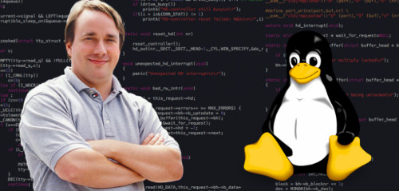

# Введение в контроль версий. Git.
***(Конспект)***

# Введение

**Система контроля версий** — это система, записывающая изменения в файл или набор файлов в течение времени и позволяющая вернуться позже к версии версии. Можно использовать контроль версий практически для любых типов файлов.

***Системы контроля версий сохраняют  только отличия от изначальной версии***, а не разные версии файла целиком. Данный способ хранения позволяет экономиgiть огромное количество памяти.

*Существует возможность отслеживания всех изменений, их фиксации и возврата к любой из зафиксированных точек.*

Использование какой-либо системы контроля версий позволяет взаимодействовать с другими участниками проекта, редакторами и пр., параллельно продолжая работу над проектом.
Можно вести работу над проектами, требующими участия большого количества участников.

# История 

Наиболее популярная система контроля версий - Git.

**Git** (произносится «гит») — распределённая система управления версиями.

Проект был создан Линусом Торвальдсом - создателем операционной системы Linux для управления разработкой ядра. В этом проекте учавствовало огромное количество программистов-энтузиастов со всего мира и для структурирования их работы был создан Git.

Первая версия Git выпущена 7 апреля 2005 года.

# Первые шаги в Git

Необходимо установить Git на свой компьютер.

Его можно скачать по ссылке:
<https://git-scm.com/book/en/v2/Getting-Started-Installing-Git>

В терминале VSCode можно посмотреть установленную версию Git командой:

git --version

***При первой установке и запуске Git необходимо пройти регистрацию.*** 

Это можно сделать всего один раз в системе, используя опцию --global

Если предполагается использовать разные имена и почту для разных проектов, то можно в каталоге с проектом не указывать функцию --global.

Необходимо ввести имя пользователя и почту:

git config --global user.name "________"

git config --global user.email ________

**ПОМНИТЕ!** 

*В дальнейшем все следы вашей жизнедеятельности в Git будут помечены указанными данными.*

Если предполагается взаимодействие с другими пользователями, работодателями и пр. лучше выбрать что-то благозвучное или, минимум, нейтральное. С этим жить.

Например, PrettyGirl_1964, Leha_Tankist_Taxi и прочие MegatronDestroer9000, возможно, не лучшие варианты для социальных взаимодействий в сфере IT.

***

Затем необходимо создать папку на своем компьютере для работы с вашим проектом и превратить ее в **репозиторий** - место, где Git будет отслеживать все изменения.

Для этого **папку** нужно **открыть в VSCode** и **использовать в терминале команду _git init_**

Git создаст в этой папке скрытую папку .git, в которой и будет сохранять изменения.

***

**ВАЖНО!**

Можно случайно сделать репозиторием весь рабочий стол, диск C и другие крупные/системные папки. В таком случае Git будет пытаться отслеживать изменения в них.

Чтобы устранить подобную ошибку требуется сделать видимыми **скрытые папки** (Через **Панель управления** в меню **Пуск**), а затем **удалить папку .git**

***

# Журнал изменений
Для просмотра истории изменений используется комманда *git log*

Для создания коммитов - фиксаций состояний используется комманда *git commit* -m "комментарий писать обязательно"

Для создания репозиторияв папке необходимо использовать команду *git init* Жту команду пишем в терминале соткрытой папкой - репозиторием.

## Создание сохранений

Для добавления файлов к commit используется комманда *git add*. Чтобы добавить файл к новому коммиту нужно написать в терминале данную комманду.

## Перемещение между коммитами
Для перемещения между коммитами используется команда git checkout номер коммита. Номера коммитов можно посмотреть коммандой...

# Журнал изменений
Для просмотра истории изменений используется комманда *git log*

